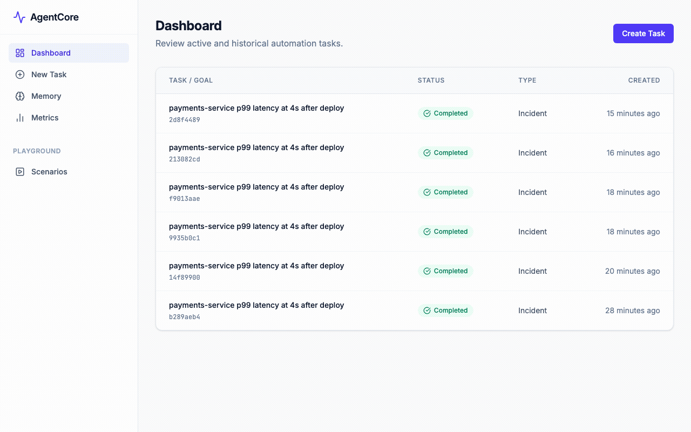
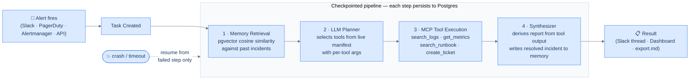
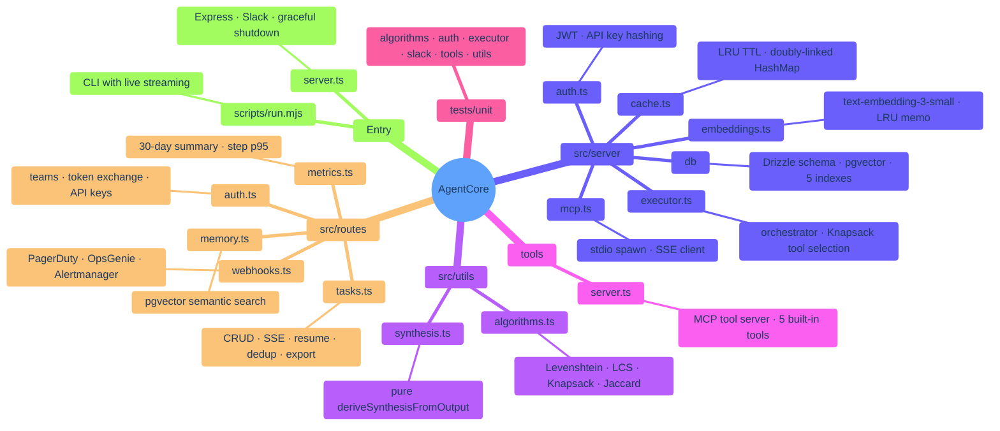

# AgentCore

[](https://github.com/TheProdSDE/agentcore/actions/workflows/ci.yml)
[](https://www.typescriptlang.org/)
[](https://nodejs.org/)
[](LICENSE)
[](https://github.com/users/theprodsde/projects/1)
[](https://www.buymeacoffee.com/theprodsde)

**Self-hosted AI incident triage with checkpointed resume and episodic memory.**

When an alert fires, AgentCore runs a 4-step pipeline — recall similar past incidents, plan tool calls with an LLM, query your logs/metrics/runbooks via MCP, synthesize a post-mortem — and posts the result back to Slack in ~30 seconds. Every step is checkpointed to Postgres so a crash mid-investigation resumes from the failed step, not from scratch. Every resolved incident is written into pgvector memory so the second DB deadlock surfaces what fixed the first one.

Apache-2.0 · runs on your infra · works with local models · **no incident data ever leaves your network**



---

## Table of Contents

- [Quickstart](#quickstart)
- [Features](#features)
- [How It Works](#how-it-works)
- [Screenshots](#screenshots)
- [Configuration](#configuration)
- [Integrations](#integrations)
  - [MCP — use from Claude / Cursor](#mcp--use-from-claude--cursor)
  - [Slack](#slack)
  - [Webhooks](#webhooks)
  - [Local models / Ollama](#local-models--ollama)
- [Auth & Multi-tenancy](#auth--multi-tenancy)
- [Development](#development)
  - [Project structure](#project-structure)
  - [Commands](#commands)
  - [Triage quality eval](#triage-quality-eval)
- [Contributing](#contributing)
- [Roadmap](#roadmap)
- [Support](#support)
- [License](#license)

---

## Quickstart

Every tool has a deterministic simulation fallback — the full stack runs with **zero credentials**.

### Docker (recommended)

```bash
# Pull and run — no build step, no .env required
curl -fsSL https://raw.githubusercontent.com/theprodsde/agentcore/main/docker-compose.demo.yml -o agentcore-demo.yml
docker compose -f agentcore-demo.yml up
```

Open `http://localhost:3000`, click **Create Task**, and describe an incident:

```
payments-service p99 latency at 4s after deploy
```

Or trigger via API:

```bash
curl -X POST http://localhost:3000/api/tasks \
  -H "Content-Type: application/json" \
  -d '{"goal": "payments-service p99 latency at 4s after deploy"}'
```

Watch the checkpoint timeline stream live. Grab the post-mortem at `/api/tasks/<id>/export.md`.

> **Have an OpenAI key?** `OPENAI_API_KEY=sk-... docker compose -f agentcore-demo.yml up` upgrades planning and synthesis to a real LLM.
> **Prefer building from source?** `git clone https://github.com/theprodsde/agentcore && cd agentcore && docker compose up --build`

### Manual

```bash
npm install
cp .env.example .env         # fill in DATABASE_URL + OPENAI_API_KEY

# Start Postgres with pgvector
docker run -d -e POSTGRES_USER=agentcore -e POSTGRES_PASSWORD=agentcore \
  -e POSTGRES_DB=agentcore -p 5432:5432 pgvector/pgvector:pg16

npm run db:migrate            # creates the pgvector extension + applies migrations
npm run dev
```

> Prebuilt images on GHCR: `docker pull ghcr.io/theprodsde/agentcore:latest`
> Jaeger UI: `http://localhost:16686`

<details>
<summary><b>Sample post-mortem output</b></summary>

```markdown
# Post-Mortem: payments-service p99 latency at 4s after deploy

**Trace ID:** `tr-7q6d5xhl9-8193`  **Duration:** 8.3s  **Retries:** 0

## Summary
The payments-service experienced a latency spike to 4230 ms, well above the 1000 ms SLO.
Deadlock conditions and lock wait timeouts were logged concurrently.

## Probable Cause
Resource contention in the payments-service database layer, specifically transaction locking
caused by insufficient connection pool sizing after the deploy.

## Affected Systems
- `payments-service`
- `postgres-primary`

## Next Actions
1. Scale horizontal replicas of payments-service to reduce per-instance load.
2. Increase Postgres connection pool size and investigate slow-query patterns.
3. Consult the High Latency Runbook for payments-service.

## Checkpoint Timeline
| Step | Name              | Status  | Duration |
|------|-------------------|---------|----------|
| 1    | memory retrieval  | success | 1.3s     |
| 2    | planner           | success | 4.7s     |
| 3    | execution         | success | 7ms      |
| 4    | synthesizer       | success | 2.4s     |
```

</details>

---

## Features

| Feature | Detail |
|---|---|
| Checkpointed orchestration | Every step persists input/output to Postgres; resumes from the last failed step — no re-running successful steps |
| Episodic memory | Incidents embedded with `text-embedding-3-small`, retrieved by pgvector cosine similarity with time-decay re-ranking |
| Dynamic MCP tool selection | LLM planner receives a live tool manifest and outputs per-tool args; 0/1 Knapsack DP prunes to fit a time budget |
| 5 built-in MCP tools | `search_logs` → Loki · `get_metrics` → Prometheus · `search_runbook` → runbook API · `create_ticket` → Linear · `list_services` |
| Incident deduplication | Jaccard + bounded Levenshtein DP + LCS — returns an existing task if a match is found within 10 minutes |
| OpenTelemetry tracing | Every task is a root span; every step a child span; `trace_id`/`span_id` in every Pino log line |
| JWT auth + multi-tenancy | HS256 tokens, per-team task/memory isolation; auth is a no-op when `JWT_SECRET` is unset |
| Webhook ingestion | PagerDuty, OpsGenie, Alertmanager — HMAC-verified payloads create tasks automatically |
| Slack integration | `!incident <description>` triggers the full pipeline; result posted back to the thread |
| Post-mortem export | `GET /api/tasks/:id/export.md` — downloadable Markdown |
| Metrics dashboard | 30-day summary, step p95, weekly trend at `/metrics` |
| CLI | `node scripts/run.mjs "<goal>"` — run investigations from the terminal with live streaming |
| MCP server | Expose AgentCore to Claude Code / Claude Desktop / Cursor — investigate, query memory, export post-mortems from any MCP client |
| Dry-run mode | Full pipeline without writing to memory or creating tickets |
| Graceful shutdown | SIGTERM → flush OTel spans → drain DB pool → close MCP subprocess |

---

## How It Works



If any step fails the task pauses with the exact error surfaced. Resume replays from the failed step — completed steps are skipped and their outputs reused, so no LLM calls are duplicated.

---

## Screenshots

| Dashboard | Task Detail |
|---|---|
|  |  |

| Create Task | Failed + Resume |
|---|---|
|  |  |

| Memory Explorer | Scenarios Playground |
|---|---|
|  |  |

---

## Configuration

| Variable | Required | Default | Description |
|---|---|---|---|
| `DATABASE_URL` | **Yes** | — | Postgres connection string (must have pgvector) |
| `OPENAI_API_KEY` | LLM steps | — | OpenAI-compatible key |
| `OPENAI_BASE_URL` | No | OpenAI | Override for local models, Azure, etc. |
| `LLM_MODEL` | No | `gpt-4o-mini` | Model for planner + synthesizer |
| `EMBEDDING_MODEL` | No | `text-embedding-3-small` | Embedding model (1536 dims) |
| `JWT_SECRET` | No | — | Enables JWT auth; unset = auth disabled |
| `SLACK_BOT_TOKEN` | No | — | Enables real Slack delivery |
| `SLACK_SIGNING_SECRET` | No | — | Verifies Slack event signatures |
| `MCP_SERVER_URL` | No | — | External MCP server (SSE); unset = spawns bundled server |
| `LOKI_URL` | No | simulation | Loki backend for `search_logs` |
| `PROMETHEUS_URL` | No | simulation | Prometheus backend for `get_metrics` |
| `RUNBOOK_URL` | No | simulation | Runbook search API |
| `LINEAR_API_KEY` | No | simulation | Linear ticket creation |
| `LINEAR_TEAM_ID` | No | — | Linear team ID |
| `PAGERDUTY_WEBHOOK_SECRET` | No | — | HMAC secret for PagerDuty webhooks |
| `OPSGENIE_WEBHOOK_SECRET` | No | — | HMAC secret for OpsGenie webhooks |
| `ALERTMANAGER_SECRET` | No | — | Shared secret for Alertmanager webhooks |
| `TOOL_BUDGET_MS` | No | `15000` | Max total tool execution time per task |
| `TOOL_CALL_TIMEOUT_MS` | No | `10000` | Hard timeout per MCP tool call |
| `LLM_TIMEOUT_MS` | No | `60000` | Timeout per LLM API call |
| `RATE_LIMIT_RPM` | No | `30` | Max task creations per minute (`0` disables) |
| `RETENTION_DAYS` | No | forever | Purge tasks + checkpoints older than N days |
| `MEMORY_RETENTION_DAYS` | No | forever | Purge episodic memories older than N days |
| `DEFAULT_TEAM_ID` | No | — | Team for Slack/webhook tasks (single-tenant) |
| `DISABLE_TEAM_SIGNUP` | No | — | `true` blocks `POST /api/teams` after bootstrap |
| `OTEL_EXPORTER_OTLP_ENDPOINT` | No | — | OTLP endpoint for Jaeger / Grafana Tempo |
| `LOG_LEVEL` | No | `warn` | Pino log level |

---

## Integrations

### MCP — use from Claude / Cursor

AgentCore exposes itself as an MCP server. Add it to Claude Code or Claude Desktop and ask *"investigate the latency spike on payments-service"* — it runs the full checkpointed pipeline with your team's memory behind it.

```bash
# Claude Code
claude mcp add agentcore --env AGENTCORE_URL=http://localhost:3000 \
  -- node /path/to/agentcore/dist/tools/agentcore-mcp.cjs
```

```json
// Claude Desktop — claude_desktop_config.json
{
  "mcpServers": {
    "agentcore": {
      "command": "node",
      "args": ["/path/to/agentcore/dist/tools/agentcore-mcp.cjs"],
      "env": {
        "AGENTCORE_URL": "http://localhost:3000",
        "AGENTCORE_TOKEN": "eyJ..."
      }
    }
  }
}
```

Exposed tools: `investigate_incident` · `get_investigation` · `search_incident_memory` · `export_postmortem`

During development: `npm run mcp` runs the server from source.

### Slack

Set `SLACK_BOT_TOKEN` and `SLACK_SIGNING_SECRET`. In any channel the bot is in:

```
!incident payments-service p99 latency at 4s after deploy
```

AgentCore runs the full pipeline and replies in the thread with the structured analysis and ticket link.

### Webhooks

HMAC-verified ingestion from three providers — no manual task creation required:

| Provider | Endpoint | Verification |
|---|---|---|
| PagerDuty | `POST /api/webhooks/pagerduty` | `PAGERDUTY_WEBHOOK_SECRET` |
| OpsGenie | `POST /api/webhooks/opsgenie` | `OPSGENIE_WEBHOOK_SECRET` |
| Alertmanager | `POST /api/webhooks/alertmanager` | `ALERTMANAGER_SECRET` header |

### Local models / Ollama

AgentCore speaks the OpenAI API, so any compatible endpoint works:

```bash
ollama pull qwen2.5:14b   # any tool-capable instruct model

# .env
OPENAI_BASE_URL=http://localhost:11434/v1
OPENAI_API_KEY=ollama
LLM_MODEL=qwen2.5:14b
```

> **Note:** The memory store expects 1536-dimension embeddings (`text-embedding-3-small`). If your local endpoint can't serve them, embedding calls fail gracefully and memory retrieval falls back to recency + keyword ranking. Configurable embedding dimensions are on the [roadmap](https://github.com/users/theprodsde/projects/1).

---

## Auth & Multi-tenancy

Auth is disabled by default (`JWT_SECRET` unset) — all requests proceed. To enable:

```bash
# 1. Create a team
curl -X POST http://localhost:3000/api/teams \
  -H "Content-Type: application/json" \
  -d '{"name": "Platform Engineering"}'

# 2. Exchange API key for a JWT
curl -X POST http://localhost:3000/api/auth/token \
  -H "Content-Type: application/json" \
  -d '{"api_key": "agentcore_..."}'

# 3. Use the token
curl http://localhost:3000/api/tasks \
  -H "Authorization: Bearer eyJ..."
```

Tasks and memories are isolated per team — a token from team A cannot read team B's data. The web dashboard shows a login screen automatically when auth is enabled.

Manage API keys via `GET`/`POST`/`DELETE /api/teams/:id/api-keys`. The last key on a team cannot be revoked. Set `DISABLE_TEAM_SIGNUP=true` after bootstrapping teams in production.


---

## Development

### Project structure



### Commands

```bash
npm run dev            # Dev server with HMR
npm run build          # Production build
npm run lint           # TypeScript type check
npm test               # Unit tests (Vitest)
npm run test:watch     # Watch mode
npm run test:coverage  # Coverage report
npm run test:integration  # Checkpoint/resume integration tests (needs TEST_DATABASE_URL)
npm run db:migrate     # Apply versioned migrations
npm run db:push        # Push schema changes (dev)
npm run db:studio      # Open Drizzle Studio
npm run eval           # Golden-incident triage quality eval (needs running server)
npm run mcp            # Run MCP server from source
```

### Triage quality eval

The demo data is an adversarial **world model** ([tools/simulation.ts](tools/simulation.ts)): each simulated service has a fixed state (healthy or degraded with a specific failure mode), and log/metric output derives from *that state* — never from the query. Ask about a deadlock on a service that has a latency regression and the report describes the latency regression.

CI runs a [golden-incident eval](evals/golden-incidents.json) on every push covering true positives, false alarms on healthy services, an unknown-service case, and an anti-circularity case where the alert's claimed symptom is wrong. Scores gate on both identifying the real cause and **not fabricating findings** the data doesn't support.

Run it locally: `npm run eval` (needs a running server). Point scenarios at real backends to benchmark LLM or prompt changes.

### Adding a new MCP tool

See [tools/README.md](tools/README.md). Add the tool definition to `TOOL_REGISTRY` in `tools/server.ts` — no other files change. The LLM planner picks it up automatically on the next run.

### Further reading

| Doc | Contents |
|---|---|
| [PRODUCTION.md](PRODUCTION.md) | Swapping each stub for a real integration |
| [ARCHITECTURE.md](ARCHITECTURE.md) | System map, extension points, scaling seams |
| [DEVELOPMENT.md](DEVELOPMENT.md) | Phase roadmap and design decisions |
| [SECURITY.md](SECURITY.md) | Threat model, prompt-injection bounds, responsible disclosure |

---

## Contributing

Pull requests are welcome. See [CONTRIBUTING.md](CONTRIBUTING.md) for setup and conventions.

The easiest first contribution is a new tool backend — Elasticsearch, Grafana, Jira, Datadog. The whole pattern lives in one file and issues labeled [`good first issue`](https://github.com/TheProdSDE/agentcore/issues?q=label%3A%22good+first+issue%22) + [`tool-integration`](https://github.com/TheProdSDE/agentcore/issues?q=label%3Atool-integration) have step-by-step specs.

- **Bugs** → [bug report template](.github/ISSUE_TEMPLATE/bug_report.yml)
- **New tools / features** → [feature request template](.github/ISSUE_TEMPLATE/feature_request.yml)
- **Questions / deployment stories** → [Discussions](https://github.com/TheProdSDE/agentcore/discussions)

Please read the [PR template](.github/PULL_REQUEST_TEMPLATE.md) before opening a PR.

---

## Roadmap

Tracked on [GitHub Projects](https://github.com/users/theprodsde/projects/1).

| Release | Highlights |
|---|---|
| **v0.2 — Scale** | Redis/BullMQ task queue · configurable embedding dims · pgvector-based dedup · ESLint in CI |
| **v0.3 — Intelligence** | Runbook auto-import · Slack app-home tab · LLM-graded memory scoring |
| **Community** | Elasticsearch · GitHub Issues · Grafana annotations · Datadog · Jira backends |

---

## Support

AgentCore is free and open-source under Apache 2.0. If it's saving your team time on incidents:

[](https://www.buymeacoffee.com/theprodsde)
[](https://www.paypal.com/paypalme/karangehlod)

You can also click **Sponsor** at the top of the repo on GitHub.

---

## License

Apache 2.0 — see [LICENSE](LICENSE).
