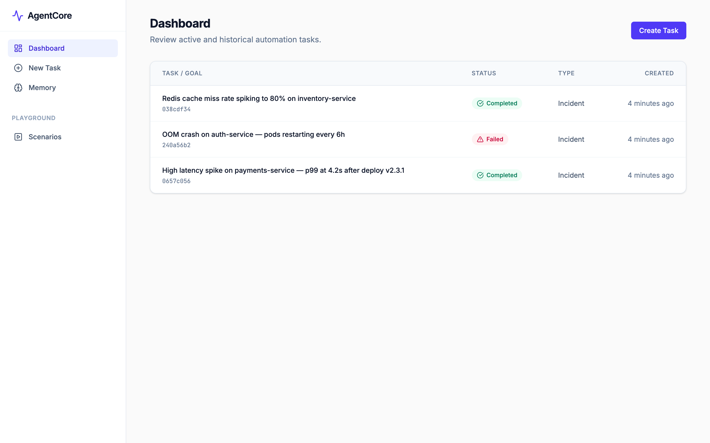
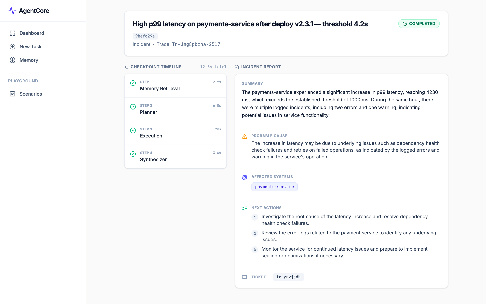
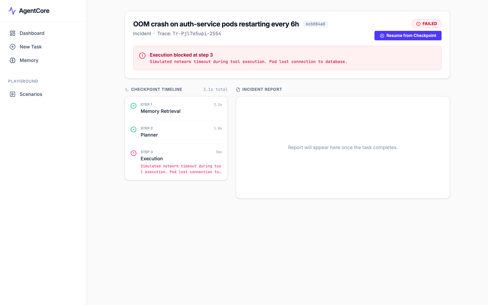
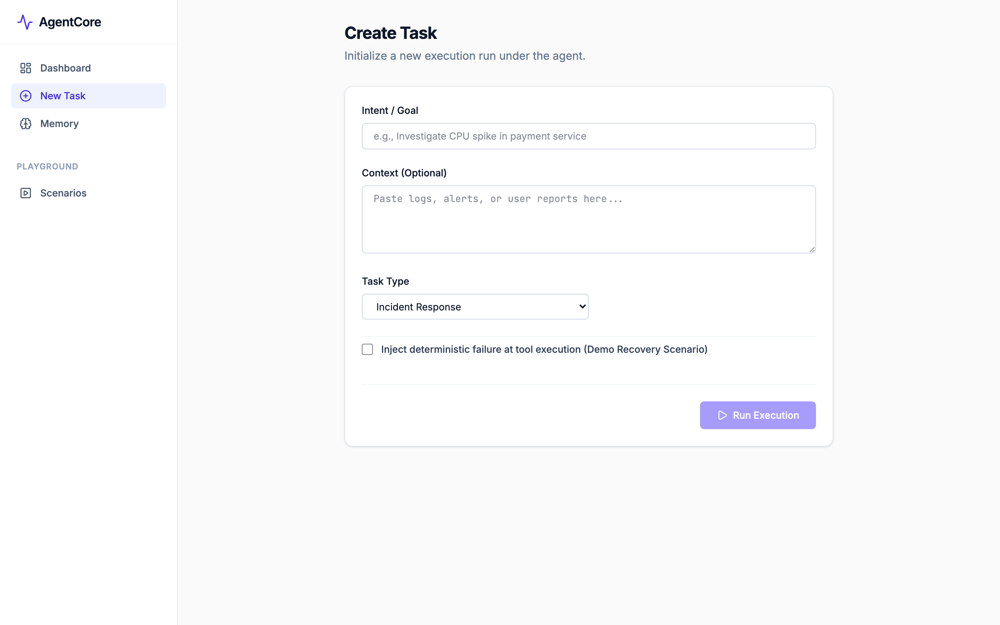
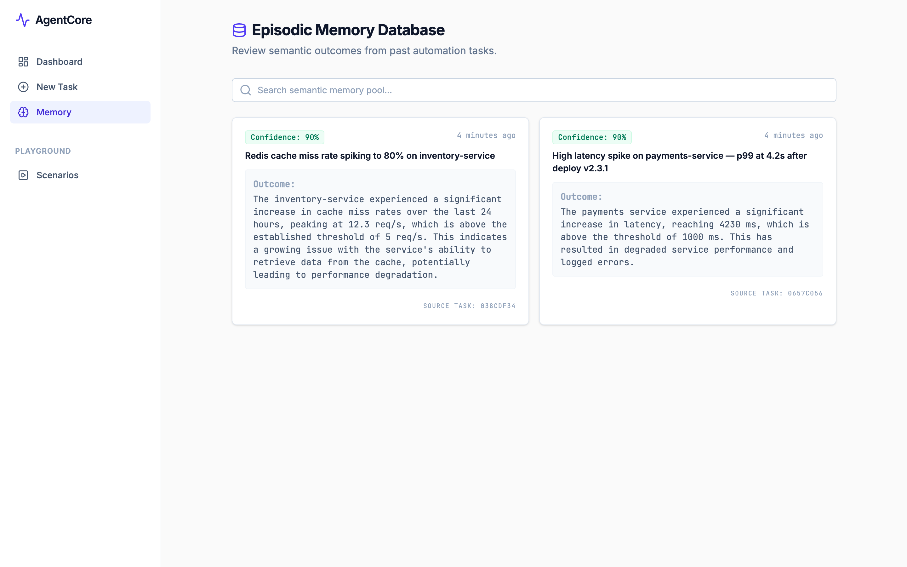
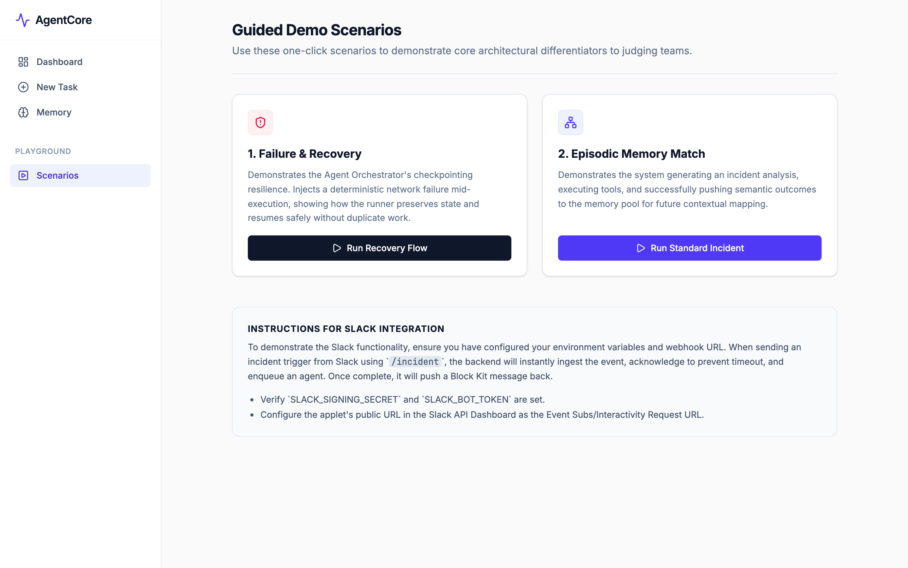
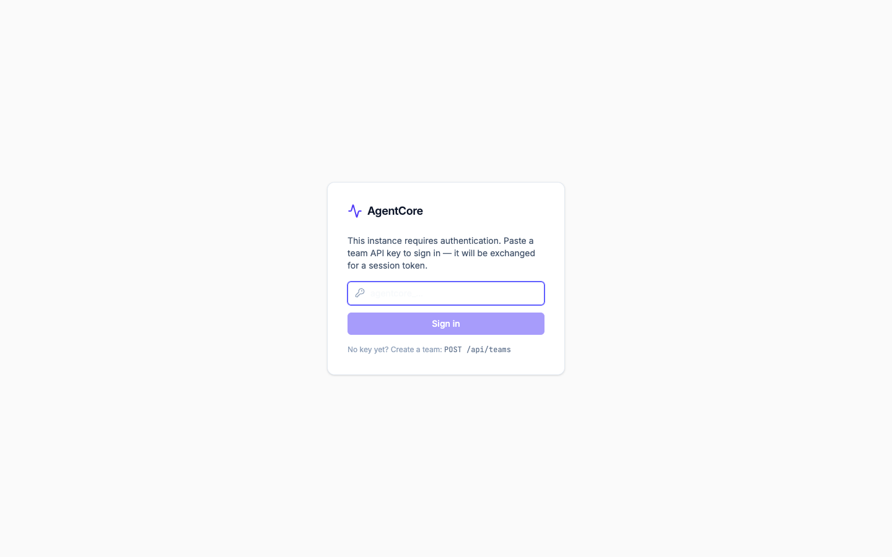

# AgentCore

[](https://github.com/TheProdSDE/agentcore/actions/workflows/ci.yml)
[](https://www.typescriptlang.org/)
[](https://nodejs.org/)
[](LICENSE)
[](https://www.buymeacoffee.com/theprodsde)

**Self-hosted, stack-agnostic AI incident triage — with checkpointed resume and episodic memory.**

When an alert fires, AgentCore runs a 4-step pipeline — recall similar past incidents, plan tool calls with an LLM, query your logs/metrics/runbooks via MCP, synthesize a report — and posts the analysis back to Slack in ~30 seconds. Every step is checkpointed to Postgres (a crash mid-investigation resumes from the failed step, not from scratch), and every resolved incident is written back into pgvector memory, so the second DB deadlock surfaces what fixed the first one.

The closed alternatives (PagerDuty AIOps, incident.io, Datadog) are expensive and take your incident data with them. The open ones are mostly Kubernetes-only. AgentCore is Apache-2.0, runs on your infra against whatever stack you have (Loki, Prometheus, Linear today — [add your own tool](CONTRIBUTING.md) in one file), and works with local models so **no incident data ever leaves your network**.

## Try it in 90 seconds — no clone, no API keys

Every tool has a deterministic simulation fallback, so the full stack runs with zero credentials. Two commands, using the prebuilt image from GHCR:

```bash
curl -fsSL https://raw.githubusercontent.com/theprodsde/agentcore/main/docker-compose.demo.yml -o agentcore-demo.yml
docker compose -f agentcore-demo.yml up
```

(Have an OpenAI key? `OPENAI_API_KEY=sk-... docker compose -f agentcore-demo.yml up` upgrades planning and synthesis to a real LLM. Prefer building from source? `git clone https://github.com/theprodsde/agentcore && cd agentcore && docker compose up --build`.)

Then open `http://localhost:3000`, hit **New Task**, and describe an incident — try
`payments-service p99 latency at 4s after deploy`. Or from the terminal:

```bash
curl -X POST http://localhost:3000/api/tasks \
  -H "Content-Type: application/json" \
  -d '{"goal": "payments-service p99 latency at 4s after deploy"}'
```

Watch the 4-step checkpoint timeline stream live, then grab the post-mortem at `/api/tasks/<task_id>/export.md`. Add `OPENAI_API_KEY` (or [point it at Ollama](#local-models--ollama)) for real LLM planning, and backend URLs for real data — same pipeline, no code changes.

<details>
<summary><b>What the output looks like</b> — a real exported post-mortem (LLM-synthesized from simulated tool data)</summary>

```markdown
# Post-Mortem: payments-service p99 latency at 4s after deploy

**Trace ID:** `tr-7q6d5xhl9-8193`
**Total duration:** 8.3s
**Retries:** 0

## Summary

The payments-service experienced a significant increase in latency, rising to
4230 ms within the last hour, triggering a threshold breach. Multiple errors,
including deadlocks and lock wait timeouts, were logged during this period.

## Probable Cause

The combination of high latency and deadlock conditions is likely due to
resource contention or saturation within the payments-service and its database
interactions, specifically related to transaction locking.

## Affected Systems

- `payments-service`
- `postgres-primary`

## Next Actions

1. Review and scale horizontal replicas of the payments-service to handle the increased load.
2. Investigate the cause of deadlocks and optimize database queries to reduce contention.
3. Consult the High Latency Runbook for payments-service for further troubleshooting steps.

## Ticket

`INC-20260920-001`

## Checkpoint Timeline

| Step | Name | Status | Duration |
|------|------|--------|----------|
| 1 | memory retrieval | success | 1.3s |
| 2 | planner | success | 4.7s |
| 3 | execution | success | 7ms |
| 4 | synthesizer | success | 2.4s |
```

With `OPENAI_API_KEY` set, the report is synthesized by the LLM from real tool output; without it, it's derived deterministically from the simulated data — same structure either way.

</details>

## Who is this for, and when should you use it

AgentCore closes the gap between **"alert fires"** and **"engineer understands what's happening and can act."** Today that gap means 15–40 minutes of manually jumping between Grafana dashboards, Kibana log searches, Slack threads, and runbooks — every single time.

### The problem it solves

When something breaks in production, an on-call engineer has to:
1. Find the right logs (which service, which time window, which query?)
2. Pull relevant metrics (what's the p99, what's the error rate, when did it spike?)
3. Cross-reference both to isolate the probable cause
4. Open a ticket, notify stakeholders, draft a post-mortem

This is repetitive investigation work. It follows the same pattern for 80% of incidents. AgentCore automates that first investigation loop so engineers can skip to step 4 — validating the AI's findings and acting.

### When to use it

**You'll get the most value if you have:**
- A production system with Slack as the ops communication channel
- More than one recurring incident type (DB locks, OOM crashes, latency regressions, cache misses)
- Engineers spending >30 min per incident just gathering context before they can act
- A small-to-mid-size team (3–50 engineers) without a dedicated SRE function

**Concrete scenarios where AgentCore helps:**

| Scenario | What AgentCore does |
|---|---|
| 3am on-call page for latency spike | Engineer types `!incident payments-service p99 at 4s`. AgentCore queries Prometheus for metrics, Loki for error logs, creates a Linear ticket, posts a structured analysis back to Slack in ~30 seconds |
| Recurring DB deadlock | Second time it fires, the memory retrieval step surfaces the previous incident's resolution ("terminated idle connections, increased pool size"). The planner incorporates that context — the engineer sees what worked last time immediately |
| Post-deploy regression | `!incident auth-service 401 errors spiking after deploy v2.3`. AgentCore correlates the deploy timestamp with the error rate spike, identifies which service version introduced the issue |
| New engineer on-call | AgentCore's checkpointed memory acts as institutional knowledge. A new engineer sees structured analysis instead of guessing which dashboards to check |
| Compliance audit | Every incident produces a full trace in Jaeger and a checkpoint record in Postgres — who ran what tool, when, what it returned. Exportable for audit logs |
| Multi-team org | Platform and security teams run separate AgentCore instances (or separate teams on one instance). Tasks and memories are isolated per team — no data leakage between teams |

### What AgentCore is NOT

- **Not a monitoring system.** It does not detect incidents — use PagerDuty, OpsGenie, or Alertmanager for that. AgentCore responds once an alert fires.
- **Not a replacement for Datadog or Grafana.** It queries your existing observability stack (Loki, Prometheus) via the MCP tool layer. You keep your dashboards.
- **Not a chatbot.** Every task runs a deterministic 4-step pipeline against real infrastructure data. The LLM plans and synthesizes; it does not answer free-form questions.
- **Not autonomous action.** AgentCore investigates and recommends. It does not restart pods, roll back deployments, or execute remediations on its own (though you can add those as MCP tools).

### What makes it different from a raw LLM query

The core difference is **state and learning**:

1. **Checkpointed** — If your server crashes mid-investigation, the task resumes from the last successful step. A raw LLM query just fails and loses all context.
2. **Memory** — After 50 incidents, AgentCore knows that "DB connection pool exhaustion on orders-service is usually fixed by bumping `max_connections` and restarting the proxy." A raw query starts from zero every time.
3. **Real tools, real data** — The synthesizer derives its conclusions from actual log entries and metric values, not from hallucinated descriptions. The planner selects tool arguments (service name, time range, metric type) based on the goal — not a hardcoded template.
4. **Audit trail** — OTel traces, Postgres checkpoints, Pino logs with `trace_id` correlation. Raw queries leave no trail.

### Organizational impact

| Team size | Expected outcome |
|---|---|
| 3–10 engineers | Eliminates the "everyone stops to help the on-call" pattern for routine incidents. One person + AgentCore handles initial triage |
| 10–50 engineers | Reduces mean time to understand (MTTU) from 20–40 min to 2–5 min for known incident classes. Frees senior engineers from repetitive triage |
| 50+ engineers, multiple teams | Multi-tenant deployment lets each team own their memory and tasks independently. Platform team can build shared tool servers that all teams consume |
| Post-incident compliance | Full checkpoint + trace record per incident satisfies audit requirements in finance, healthcare, and regulated industries |

## How it works

```
[Slack / Dashboard] → Task Created
        ↓
  1. Memory Retrieval   — pgvector cosine similarity against past incidents
  2. LLM Planner        — selects tools from live manifest with per-tool args
  3. MCP Tool Execution — search_logs, get_metrics, search_runbook, create_ticket, list_services
  4. Synthesizer        — derives report from actual tool output, writes to memory
        ↓
[Result posted to Slack thread / visible in Dashboard]
```

If any step fails, the task pauses. On resume, completed checkpoints are skipped — no redundant work, no re-running LLM calls.

## Screenshots

**Dashboard** — live task list with status badges, auto-refreshes every 5 seconds.



---

**Task Detail — Completed** — 4-step checkpoint timeline with per-step durations; AI-synthesized incident report on the right, derived from real MCP tool output.



---

**Task Detail — Failed with Resume** — when a step fails the task pauses and surfaces the exact error. "Resume from Checkpoint" replays from the failed step only — steps 1 and 2 are skipped.



---

**Create Task** — describe the incident goal, optionally paste log snippets or alert context, then hit Run. The full pipeline runs asynchronously.



---

**Episodic Memory** — every completed task writes its synthesized summary as an embedding. The search bar runs a pgvector cosine-similarity query to surface semantically similar past incidents.



---

**Scenarios Playground** — one-click flows to exercise failure + recovery and the episodic memory write path. Useful for onboarding or testing a fresh deployment.



---

## Features

| Feature | Detail |
|---|---|
| Checkpointed orchestration | Every step persists input/output to Postgres; resumes from last failed step |
| pgvector semantic memory | Memories embedded with `text-embedding-3-small`, retrieved by cosine similarity with time-decay re-ranking |
| Dynamic MCP tool selection | LLM planner receives live tool manifest and outputs per-tool args; 0/1 Knapsack DP prunes to fit time budget |
| 5 built-in MCP tools | `search_logs` → Loki · `get_metrics` → Prometheus · `search_runbook` → runbook API · `create_ticket` → Linear · `list_services` |
| Incident deduplication | Jaccard + bounded Levenshtein DP + LCS similarity — returns existing task if a match is found within 10 minutes |
| OpenTelemetry tracing | Every step is a span; `trace_id`/`span_id` injected into every Pino log line |
| JWT auth + multi-tenancy | HS256 tokens, per-team task/memory isolation; auth is a no-op when `JWT_SECRET` unset |
| Webhook ingestion | PagerDuty, OpsGenie, Alertmanager — HMAC-verified payloads create tasks automatically |
| Slack integration | `!incident <description>` triggers a full pipeline run; result posted back to thread |
| Post-mortem export | `GET /api/tasks/:id/export.md` — downloadable Markdown post-mortem |
| Metrics dashboard | `/metrics` page + `/api/metrics` endpoint — 30-day summary, step p95, weekly trend |
| CLI | `node scripts/run.mjs "<goal>"` — run investigations from the terminal with live streaming |
| MCP server | Expose AgentCore itself to Claude Code / Claude Desktop / Cursor — investigate, query memory, export post-mortems from any MCP client |
| Dry-run mode | `dry_run: true` — full pipeline without writing to memory or creating tickets |
| Graceful shutdown | SIGTERM → flush OTel spans → drain DB pool → close MCP subprocess |

## Use AgentCore from Claude (MCP)

AgentCore ships an MCP server that exposes a running instance to any MCP client — Claude Code, Claude Desktop, Cursor. Ask Claude *"investigate the latency spike on payments-service"* and it runs a full checkpointed investigation with your team's incident memory behind it.

```bash
# Claude Code
claude mcp add agentcore --env AGENTCORE_URL=http://localhost:3000 \
  -- node /path/to/agentcore/dist/tools/agentcore-mcp.cjs
```

```json
// Claude Desktop (claude_desktop_config.json)
{
  "mcpServers": {
    "agentcore": {
      "command": "node",
      "args": ["/path/to/agentcore/dist/tools/agentcore-mcp.cjs"],
      "env": { "AGENTCORE_URL": "http://localhost:3000", "AGENTCORE_TOKEN": "eyJ... (only if JWT auth is enabled)" }
    }
  }
}
```

Exposed tools: `investigate_incident` (runs the pipeline, waits for the report), `get_investigation` (status + checkpoint timeline), `search_incident_memory` (semantic search over past incidents), `export_postmortem` (Markdown). During development, `npm run mcp` runs it from source.

## Local models / Ollama

AgentCore speaks the OpenAI API, so any compatible endpoint works — including [Ollama](https://ollama.com). No incident data leaves your network:

```bash
ollama pull qwen2.5:14b   # any tool-capable instruct model works

# .env
OPENAI_BASE_URL=http://localhost:11434/v1
OPENAI_API_KEY=ollama          # any non-empty value
LLM_MODEL=qwen2.5:14b
```

The planner and synthesizer now run fully local. One honest caveat: the memory store expects 1536-dimension embeddings (`text-embedding-3-small`). If your local endpoint can't serve a 1536-dim embedding model, embedding calls fail gracefully and memory retrieval falls back to recency + keyword ranking — everything still works, semantic recall is just weaker. Configurable embedding dimensions are on the [roadmap](ROADMAP.md).

## Quickstart

### Docker (recommended)

```bash
cp .env.example .env
# fill in OPENAI_API_KEY and optionally Slack/Linear credentials
docker-compose up --build
```

Prebuilt images are published to GHCR on every release:

```bash
docker pull ghcr.io/theprodsde/agentcore:latest
```

- App: `http://localhost:3000`
- Jaeger UI: `http://localhost:16686`

### Manual

```bash
npm install
cp .env.example .env   # fill in DATABASE_URL + OPENAI_API_KEY
# Start Postgres with pgvector
docker run -d --name agentcore-pg -e POSTGRES_USER=agentcore \
  -e POSTGRES_PASSWORD=agentcore -e POSTGRES_DB=agentcore \
  -p 5432:5432 pgvector/pgvector:pg16
npm run db:migrate    # creates the pgvector extension + applies versioned migrations
npm run dev
```

## Environment variables

| Variable | Required | Description |
|---|---|---|
| `DATABASE_URL` | Yes | Postgres connection string (must have pgvector extension) |
| `OPENAI_API_KEY` | For LLM steps | OpenAI-compatible key |
| `OPENAI_BASE_URL` | No | Override API base (local models, etc.) |
| `LLM_MODEL` | No | Model for planner + synthesizer (default: `gpt-4o-mini`) |
| `EMBEDDING_MODEL` | No | Embedding model (default: `text-embedding-3-small`) |
| `JWT_SECRET` | No | Enables JWT auth when set. Unset = auth disabled (dev mode) |
| `SLACK_BOT_TOKEN` | No | Enables real Slack message delivery |
| `SLACK_SIGNING_SECRET` | No | Verifies Slack event signatures (v0 HMAC + replay protection). Unset = events accepted unverified (dev only) |
| `MCP_SERVER_URL` | No | External MCP server (SSE). Unset = spawns bundled tools server |
| `LOKI_URL` | No | Loki log backend for `search_logs` tool |
| `PROMETHEUS_URL` | No | Prometheus backend for `get_metrics` tool |
| `RUNBOOK_URL` | No | Runbook search API for `search_runbook` tool |
| `LINEAR_API_KEY` | No | Linear ticket creation for `create_ticket` tool |
| `LINEAR_TEAM_ID` | No | Linear team ID |
| `PAGERDUTY_WEBHOOK_SECRET` | No | HMAC secret for PagerDuty webhook verification |
| `OPSGENIE_WEBHOOK_SECRET` | No | HMAC secret for OpsGenie webhook verification |
| `ALERTMANAGER_SECRET` | No | Shared secret header for Alertmanager webhook |
| `TOOL_BUDGET_MS` | No | Max total tool execution time per task in ms (default: `15000`) |
| `TOOL_CALL_TIMEOUT_MS` | No | Hard wall-clock timeout per MCP tool call in ms (default: `10000`) |
| `LLM_TIMEOUT_MS` | No | Timeout per LLM API call in ms (default: `60000`) |
| `RATE_LIMIT_RPM` | No | Max task creations per minute per team/IP/channel (default: `30`, `0` disables) |
| `RETENTION_DAYS` | No | Purge tasks + checkpoints older than N days (default: keep forever) |
| `MEMORY_RETENTION_DAYS` | No | Purge episodic memories older than N days (default: keep forever) |
| `DEFAULT_TEAM_ID` | No | Team that owns Slack/webhook-created tasks. Unset = visible to all teams (single-tenant only) |
| `DISABLE_TEAM_SIGNUP` | No | `true` blocks `POST /api/teams` after initial bootstrap |
| `OTEL_EXPORTER_OTLP_ENDPOINT` | No | OTLP endpoint for Jaeger/Grafana Tempo |
| `LOG_LEVEL` | No | Pino log level (default: `warn`) |

## Auth

When `JWT_SECRET` is unset, auth is disabled — all requests proceed. To enable:

```bash
# Create a team and get the first API key
curl -X POST http://localhost:3000/api/teams \
  -H "Content-Type: application/json" \
  -d '{"name":"Platform Engineering"}'

# Exchange key for JWT
curl -X POST http://localhost:3000/api/auth/token \
  -H "Content-Type: application/json" \
  -d '{"api_key":"agentcore_..."}'

# Use token
curl http://localhost:3000/api/tasks \
  -H "Authorization: Bearer eyJ..."
```

Tasks and memories are isolated per team. A token from team A cannot read team B's data.

The web dashboard shows a login screen automatically when auth is enabled — paste a team API key and it's exchanged for a session token (stored locally, re-prompted on expiry).

 Manage keys via `GET`/`POST`/`DELETE /api/teams/:team_id/api-keys` — the last remaining key cannot be revoked, so a team can't lock itself out. Set `DISABLE_TEAM_SIGNUP=true` once your teams exist, and `DEFAULT_TEAM_ID` so Slack/webhook-created tasks belong to a team instead of being globally visible.

## Project structure

```
server.ts               Express entry point — mounts routes, handles Slack, graceful shutdown
scripts/
  run.mjs               CLI — run investigations from the terminal with live streaming
src/
  components/
    ErrorBoundary.tsx   React error boundary — catches render errors, shows fallback UI
  routes/               Route handlers (one file per domain)
    auth.ts             POST /api/teams, POST /api/auth/token, POST /api/teams/:id/api-keys
    health.ts           GET /api/health, GET /api/health/detailed (parallel checks)
    tasks.ts            CRUD + SSE stream + resume + post-mortem export + incident dedup
    memory.ts           Memory retrieval + pgvector semantic query (paginated)
    metrics.ts          GET /api/metrics — 30-day summary, step p95, weekly trend (cached)
    webhooks.ts         POST /api/webhooks/{pagerduty,opsgenie,alertmanager} (HMAC-verified)
  server/
    executor.ts         Orchestrator + step handlers + 0/1 Knapsack tool selection
    auth.ts             JWT middleware, token signing, API key hashing
    cache.ts            LRU TTL cache (doubly-linked list + HashMap) for tool results
    llm.ts              Shared OpenAI client singleton + model constants
    embeddings.ts       text-embedding-3-small wrapper with LRU memoization
    mcp.ts              MCP client — spawns tools/server.ts via stdio or connects via SSE
    telemetry.ts        OTel provider + tracer export
    logger.ts           Pino logger with trace_id/span_id mixin
    db/                 Drizzle schema + connection (pgvector, 5 indexes)
  utils/
    index.ts            parseLLMJson, generateTraceId, toErrorMessage
    algorithms.ts       Levenshtein DP, bounded DP, LCS, top-k heap, LRU, Jaccard, Knapsack
    synthesis.ts        deriveSynthesisFromOutput — pure function, no infrastructure deps
tools/
  server.ts             MCP tool server — search_logs, get_metrics, search_runbook, create_ticket, list_services
  README.md             How to add tools and connect real backends
tests/
  unit/
    algorithms.test.ts  Levenshtein, LCS, Knapsack, top-k, Jaccard, LRU, similarity
    auth.test.ts        JWT, API key hashing, middleware
    executor.test.ts    deriveSynthesisFromOutput, planner/synthesizer output contracts
    slack.test.ts       Slack request signature verification (HMAC v0, replay protection)
    tools.test.ts       parseRange, filter logic, metric simulation, output shapes
    utils.test.ts       parseLLMJson, generateTraceId, toErrorMessage
```

## Development commands

```bash
npm run dev          # Start dev server (tsx + Vite HMR)
npm run build        # Production build (Vite + esbuild)
npm run lint         # TypeScript type check
npm test             # Run test suite (Vitest)
npm run test:watch   # Watch mode
npm run test:coverage  # Coverage report
npm run db:push      # Push schema to DB (creates/alters tables)
npm run db:studio    # Open Drizzle Studio
```

## Adding a new MCP tool

See [tools/README.md](tools/README.md). Add the tool definition to `TOOL_REGISTRY` in `tools/server.ts` — no other files need to change. The LLM planner receives the updated manifest automatically on the next run.

## Production path

See [PRODUCTION.md](PRODUCTION.md) for how to swap each stub for a real integration. See [ARCHITECTURE.md](ARCHITECTURE.md) for the system map, extension points (new tools, pipeline steps, alert sources), and the scaling seams where future features land. See [DEVELOPMENT.md](DEVELOPMENT.md) for the full phase roadmap.

## Contributing

Pull requests are welcome — see [CONTRIBUTING.md](CONTRIBUTING.md) for setup and conventions. The best first contribution is a new tool backend (Elasticsearch, Grafana, Jira, Datadog, ...): the whole pattern lives in one file, and issues labeled `good first issue` + `tool-integration` have step-by-step specs.

Please read the [PR template](.github/PULL_REQUEST_TEMPLATE.md) before opening a PR — it's short. The checklist covers the basics: types clean, tests green, no secrets in the diff.

For bugs, use the [bug report](.github/ISSUE_TEMPLATE/bug_report.yml) template. For new tools or integrations, use the [feature request](.github/ISSUE_TEMPLATE/feature_request.yml) template.

For questions, usage help, or sharing how you've deployed AgentCore — use [Discussions](https://github.com/TheProdSDE/agentcore/discussions) rather than Issues.

## Support the project

AgentCore is open-source and free to use under Apache 2.0. If it's saving your team time on incidents, consider supporting continued development:

| Platform | Link |
|---|---|
| Buy Me a Coffee | [buymeacoffee.com/theprodsde](https://www.buymeacoffee.com/theprodsde) |
| PayPal | [paypal.me/karangehlod](https://www.paypal.com/paypalme/karangehlod) |

You can also click the **Sponsor** button at the top of this repo on GitHub.

## License

Apache 2.0 — see [LICENSE](LICENSE).
